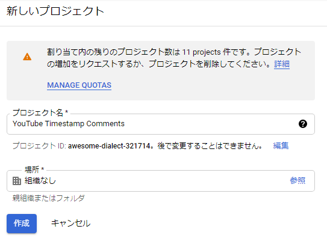
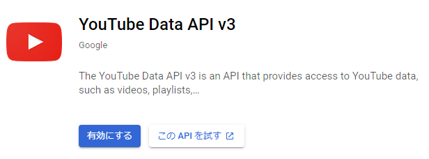
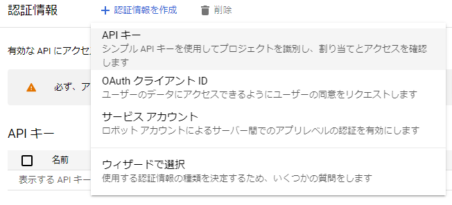
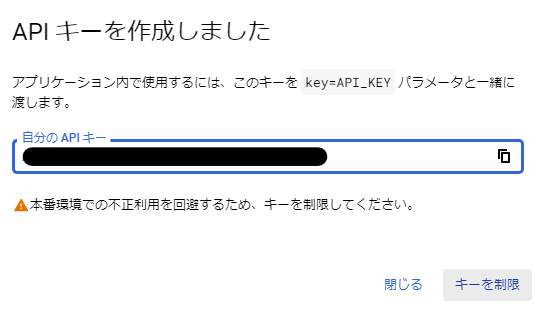
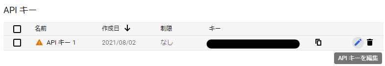
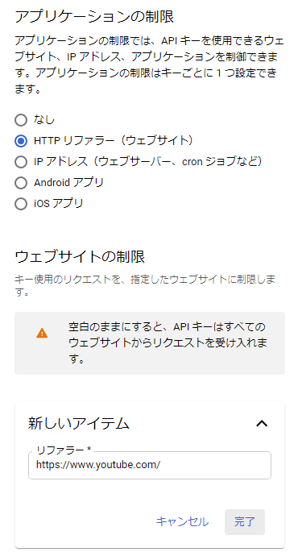
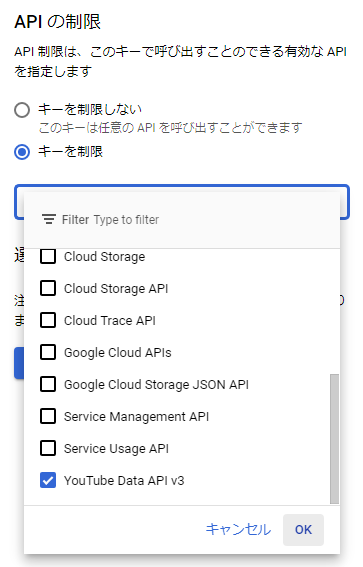
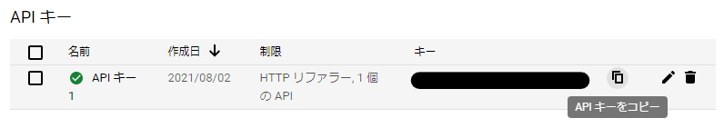

# YouTube Timestamp Comments

[English](./README.md) | 日本語

YouTube の時間指定コメントを表示する Google Chrome 拡張機能です。主な機能は以下の通りです。

- タイムスタンプを含むコメントを表示
- 時間の早い順にソート
- タイムスタンプのクリックで再生位置をジャンプ

ストアページ: https://chrome.google.com/webstore/detail/youtube-timestamp-comment/khngjoedfeicfbjlcfmiigbokbnlibei

## APIキーの取得と設定

この拡張機能を使用するには YouTube Data API のAPIキーが必要です。以下の手順でAPIキーを取得し、設定してください。

なお、設定したAPIキーをこの拡張機能が収集することはありません。また、APIキーの取得および使用は無料です。

1. プロジェクトを作成する。
    1. https://console.cloud.google.com/projectcreate にアクセスする。
        - プロジェクトを作成するにはGoogleのアカウントが必要です。
        - 上のリンクをクリックしてログイン画面が表示された場合は、お持ちのアカウントでログインを行ってください。
        - アカウントをお持ちでない場合は作成をお願いいたします。
    2. 「プロジェクト名」と「場所」に任意の値を設定して、「作成」をクリックする。  
        
2. YouTube Data API を有効にする。
    1. https://console.cloud.google.com/apis/library/youtube.googleapis.com にアクセスする。
    2. 「有効にする」をクリックする。  
        
3. APIキーを作成する。
    1. https://console.cloud.google.com/apis/credentials にアクセスする。
    2. 「+ 認証情報を作成」をクリックし、「APIキー」を選択する。  
        
    3. 「キーを制限」をクリックする。  
        
        - 「キーを制限」をクリックせずに閉じてしまった場合は、APIキーのリストにある編集アイコンをクリックしてください。  
            
    4. 「アプリケーションの制限」の「HTTP リファラー（ウェブサイト）」を選択し、「ウェブサイトの制限」の「項目を追加」をクリック後、「新しいアイテム」の欄に `https://www.youtube.com/` と入力して「完了」をクリックする。  
        
    5. 「APIの制限」の「キーを制限」を選択し、ドロップダウンから `YouTube Data API v3` にチェックをつけて「OK」をクリックする。  
        
    6. 「保存」をクリックする。
4. APIキーをコピーする。
    1. https://console.cloud.google.com/apis/credentials にアクセスする。
    2. APIキーのリストにあるコピーアイコンをクリックする。  
        
5. APIキーを設定する。
    1. 任意の YouTube 動画を開く。
    2. この拡張機能のアイコンをクリックし、歯車マークをクリックする。
    3. API Key の欄にコピーしたAPIキーを貼り付ける。

以上で設定は完了です。拡張機能の `>` ボタンをクリックするとコメントが取得できるようになっているはずです。

なお、1つのAPIキーあたり、1日に10,000回のコメント取得が可能です。
