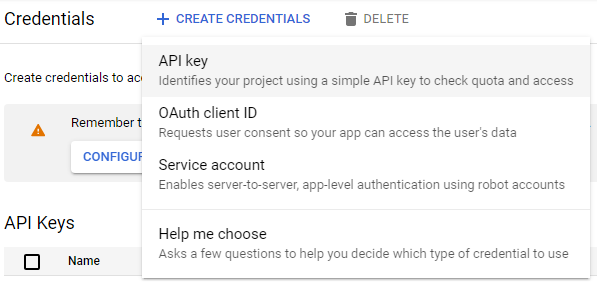

# YouTube Timestamp Comments

English | [日本語](./README.ja.md)

This is a Google Chrome extension that displays timestamp comments on YouTube. The main features are:

- displays timestamp comments
- sorts by timestamp
- jumps playback position to timestamp

Store page: https://chrome.google.com/webstore/detail/youtube-timestamp-comment/khngjoedfeicfbjlcfmiigbokbnlibei

## Create and set an API key

To use this extension, you need an API key for YouTube Data API. Please follow the steps below to create and set it. It is free to create and use the API key.

Note that this extension will not collect your API key.

1. Create a project.
    1. Go to https://console.cloud.google.com/projectcreate .
        - You need a Google account to create a project.
        - If the sign-in page appears when you click on the link above, sign-in with your account.
        - If you do not have an account, create one.
    2. Set any values for "Project name" and "Location", and then click "CREATE".  
        
2. Enable YouTube Data API.
    1. Go to https://console.cloud.google.com/apis/library/youtube.googleapis.com .
    2. Click "ENABLE".  
        
3. Create an API key.
    1. Go to https://console.cloud.google.com/apis/credentials .
    2. Click "+ CREATE CREDENTIALS", and then choose "API key".  
        
    3. Click "RESTRICT KEY".  
        
        - If you closed without clicking "RESTRICT KEY", click the edit icon in the list of API keys.  
            
    4. Select "HTTP referrers (web sites)" under "Application restrictions", click "ADD AN ITEM" under "Website restrictions", enter `https://www.youtube.com/` in "New item" field, and click "DONE".  
        
    5. Select "Restrict key" under "API restrictions", tick `YouTube Data API v3` from the dropdown, and click "OK".  
        
    6. Click "SAVE".
4. Copy the API key.
    1. Go to https://console.cloud.google.com/apis/credentials .
    2. Click the copy icon in the list of API keys.  
        
5. Set the API key.
    1. Open any YouTube page.
    2. Click the icon of this extension, and click the cog icon.
    3. Paste the API key you copied into the field.

The set up is done. Click the `>` button on the extension and you will retrieve comments.

Note that each API key can retrieve up to 100 comments 10,000 times per day.
