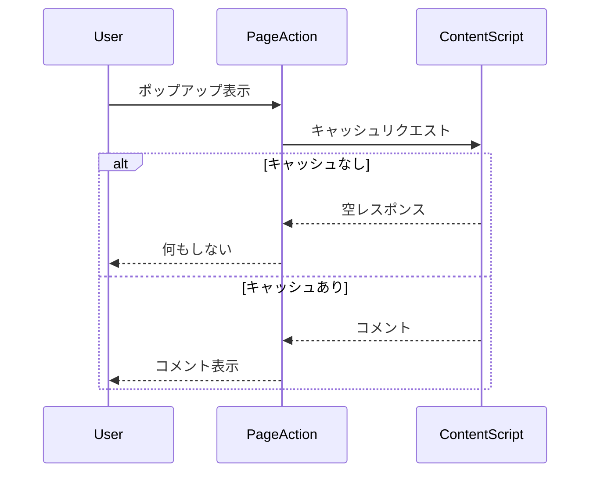
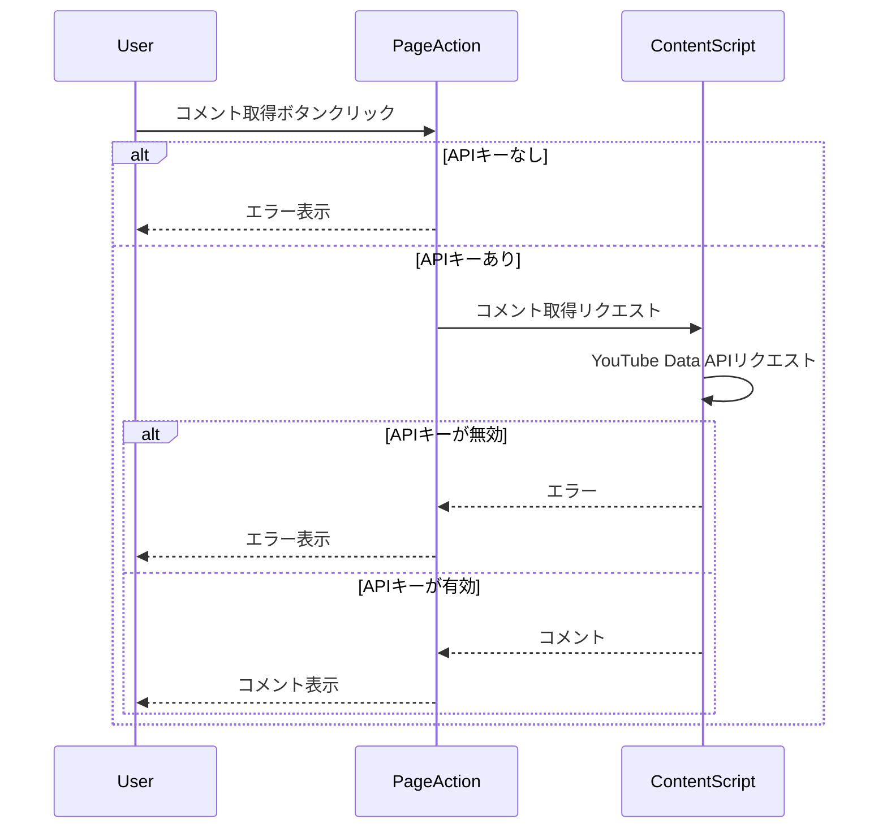

# シーケンス図

## 初期画面

```mermaid
sequenceDiagram
    participant U as User
    participant P as PageAction
    participant C as ContentScript

    U ->> P: ポップアップ表示
    P ->> C: キャッシュリクエスト
    alt キャッシュなし
        C -->> P: 空レスポンス
        P -->> U: 何もしない
    else キャッシュあり
        C -->> P: コメント
        P -->> U: コメント表示
    end
```

## コメント取得

```mermaid
sequenceDiagram
    participant U as User
    participant P as PageAction
    participant C as ContentScript

    U ->> P: コメント取得ボタンクリック
    alt APIキーなし
        P -->> U: エラー表示
    else APIキーあり
        P ->> C: コメント取得リクエスト
        C ->> C: YouTube Data APIリクエスト
        alt APIキーが無効
            C -->> P: エラー
            P -->> U: エラー表示
        else APIキーが有効
            C -->> P: コメント
            P -->> U: コメント表示
        end
    end
```
